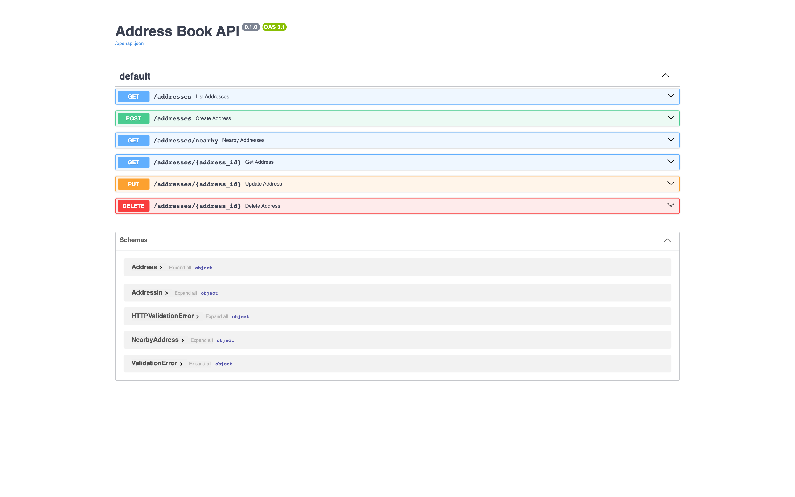
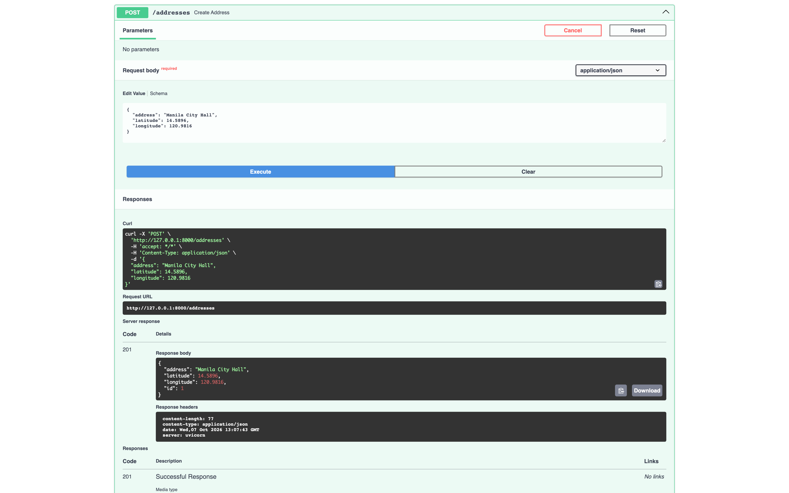
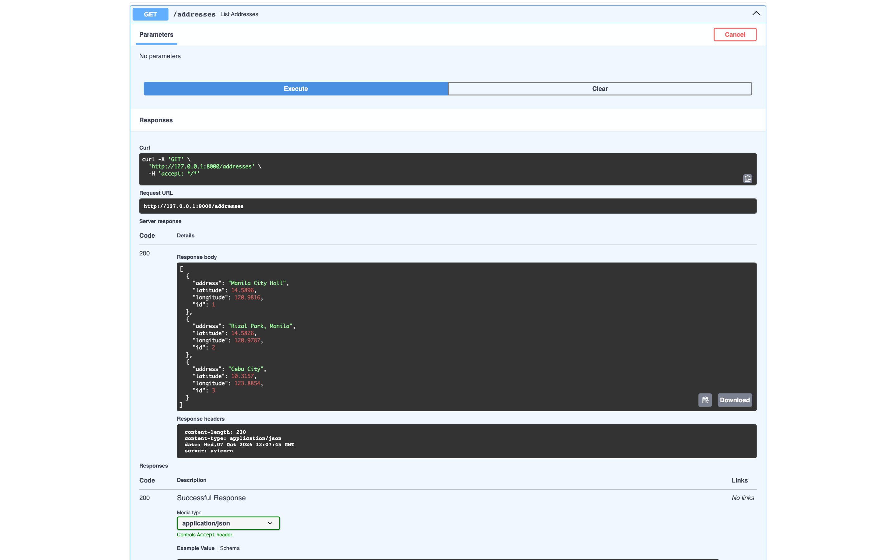
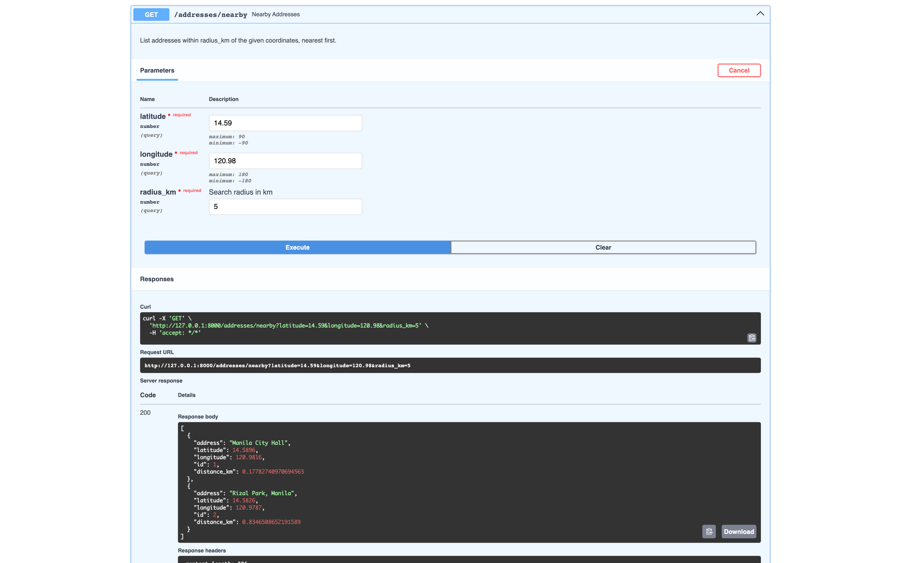
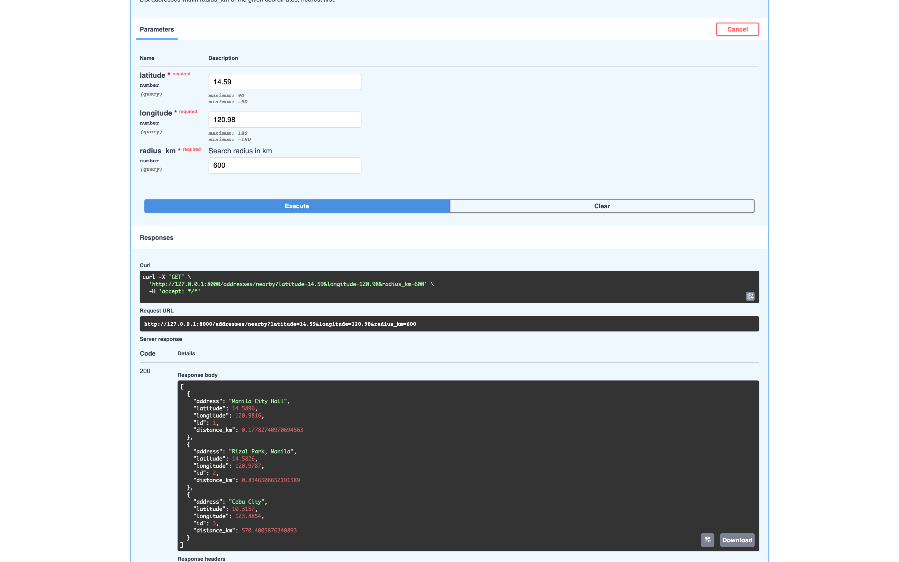
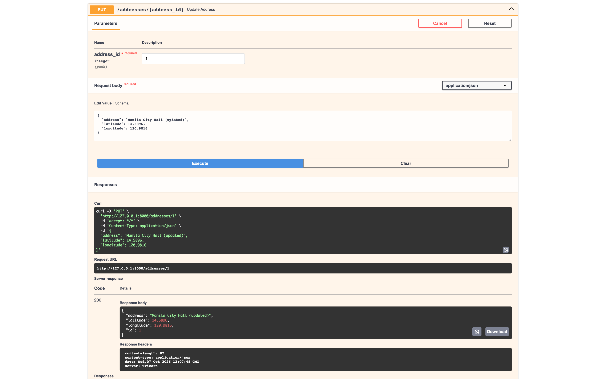
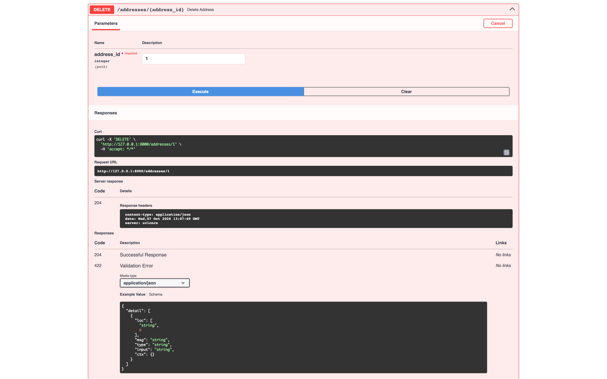
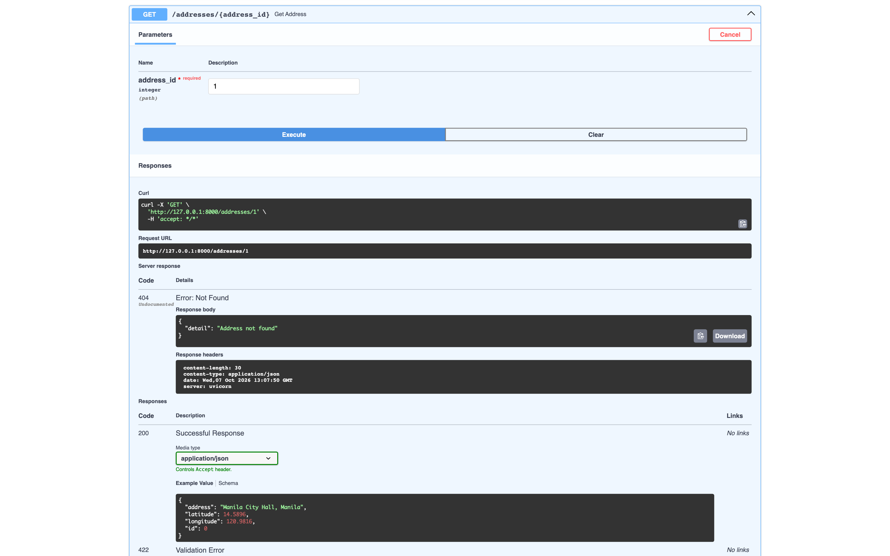
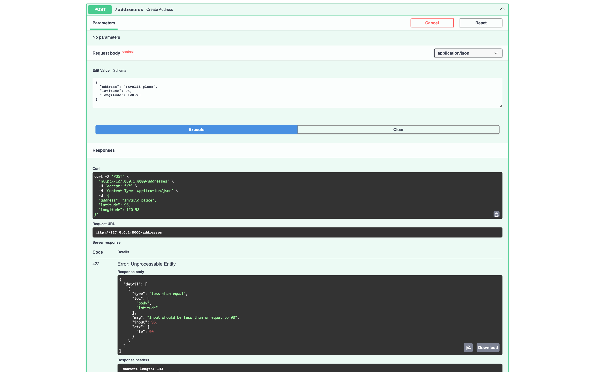

# FastAPI Address Book

A minimal address book API built with FastAPI and SQLite. Create, update and delete
addresses with validated coordinates, and find addresses within a distance of a point.

## Run

Requires Python 3.10 or newer.

```sh
git clone https://github.com/ProfBelts/fast-api-address-book.git
cd fast-api-address-book
python3 -m venv .venv
source .venv/bin/activate          # Windows: .venv\Scripts\activate
pip install -r requirements.txt
uvicorn app.main:app --reload
```

Open http://127.0.0.1:8000/docs to use the API from Swagger UI.
The SQLite database `addresses.db` is created on first start.

## Endpoints

| Method | Path | Description |
| --- | --- | --- |
| POST | `/addresses` | Create an address |
| GET | `/addresses` | List all addresses |
| GET | `/addresses/{id}` | Get one address |
| PUT | `/addresses/{id}` | Replace an address |
| DELETE | `/addresses/{id}` | Delete an address |
| GET | `/addresses/nearby?latitude=&longitude=&radius_km=` | Addresses within `radius_km`, nearest first |

Validation: `address` is 1 to 500 characters (trimmed), `latitude` is -90 to 90,
`longitude` is -180 to 180, `radius_km` is greater than 0. Invalid input returns 422;
an unknown ID returns 404. Distance is the great-circle (haversine) distance in kilometers.

Example:

```sh
curl -X POST http://127.0.0.1:8000/addresses \
  -H 'Content-Type: application/json' \
  -d '{"address": "Manila City Hall", "latitude": 14.5896, "longitude": 120.9816}'

curl 'http://127.0.0.1:8000/addresses/nearby?latitude=14.59&longitude=120.98&radius_km=5'
```

## Test

```sh
python -m pytest
```

## Structure

- `app/main.py`: routes, logging and distance calculation
- `app/schemas.py`: Pydantic validation models
- `app/database.py`: SQLite connection and table setup
- `tests/test_api.py`: API tests

## Screenshots

Taken from Swagger UI against a running server with an empty database.

**Swagger UI**



**Create an address (201)**



**List addresses (200)**



**Search within 5 km (200):** the two Manila addresses, nearest first



**Search within 600 km (200):** Cebu City is included at about 570 km



**Update an address (200)**



**Delete an address (204)**



**Get a deleted address (404)**



**Invalid latitude rejected (422)**


